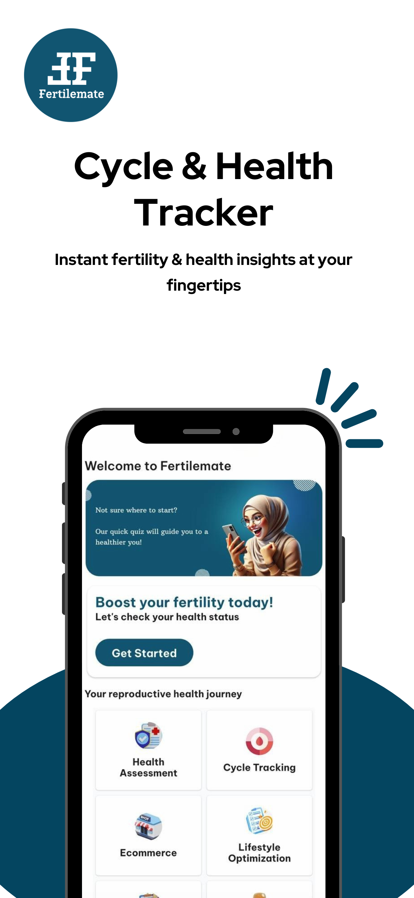
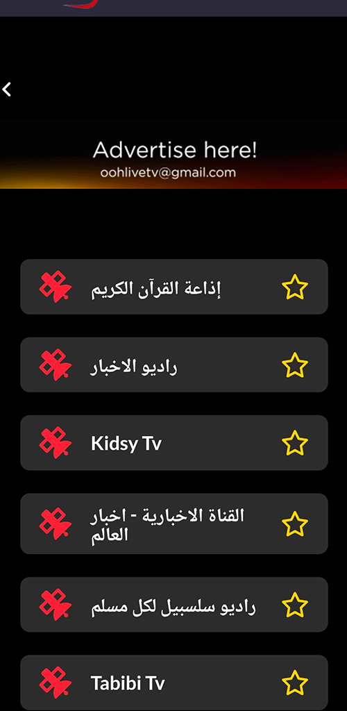
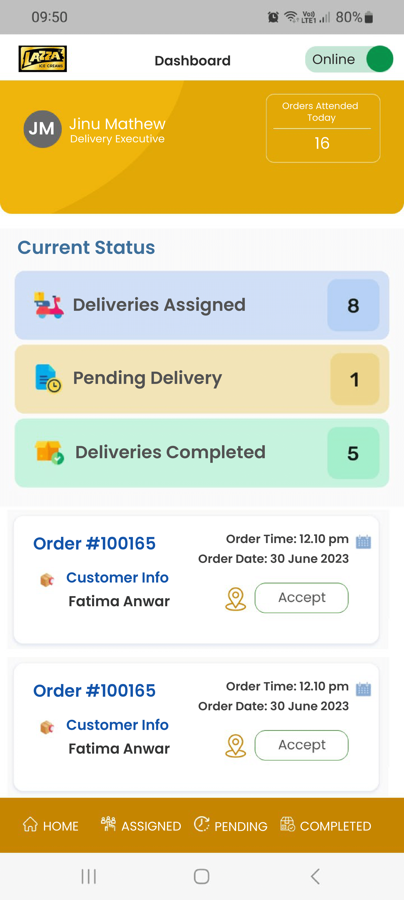
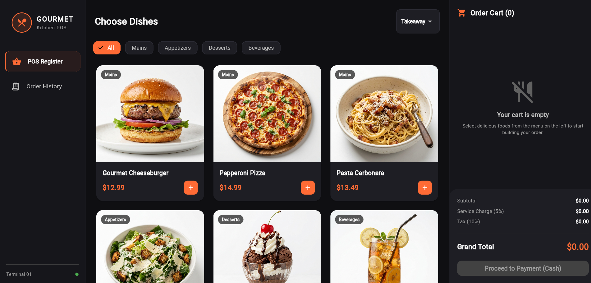

# Flutter

## Fertilemate

Fertilemate is a reproductive health app. I implemented a chat with doctors feature with Firebase, social media login, and ported the app to iOS. Also migrated the backend to new server.

[Android](https://play.google.com/store/apps/details?id=com.fertilemate.app&hl=en)

[iOS](https://apps.apple.com/id/app/fertilemate/id6502899639)

## Ooh Live TV

Ooh live Tv is a TV streaming app. I fixed a bug in which a video from some channel are not playing.

[Android](https://play.google.com/store/apps/details?id=com.oohlivetv.webplayer&hl=en)

## Lazza

Lazza is an app for ice cream bussiness. Features include taking and tracking ice cream delivery, showing scheduled delivery time, and customer address map.

## Restaurant POS

A restaurant POS app. I connect this app to a backend and added a feature to print receipt with BLE printer.